# Yeah! Yak! 💊
약국 발주 자동화의 첫걸음 🚀

- 배포 URL : http://4.230.25.25/

 

## 프로젝트 소개
- 예약은 약국 프랜차이즈 본사와 가맹 약국의 발주 및 재고 관리를 자동화하는 SaaS 플랫폼입니다.
- AI 기반 자동화를 통해 업무 부담을 줄이고 효율성을 높입니다.

---

## 👥 참여 인원

---

## 기술 스택
### 🖥 Frontend

### ⚙ Backend

### 🗄 Database

### 🤖 AI & Data

### ☁ Infra

---

## 🖥️ 주요 기능

### 1. 본사/가맹점 회원관리

| 로그인 | 가맹점 회원가입 | 본사 회원가입 |
|--------|----------------|---------------|
| 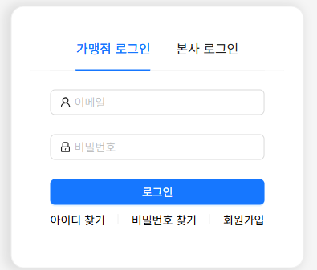 | 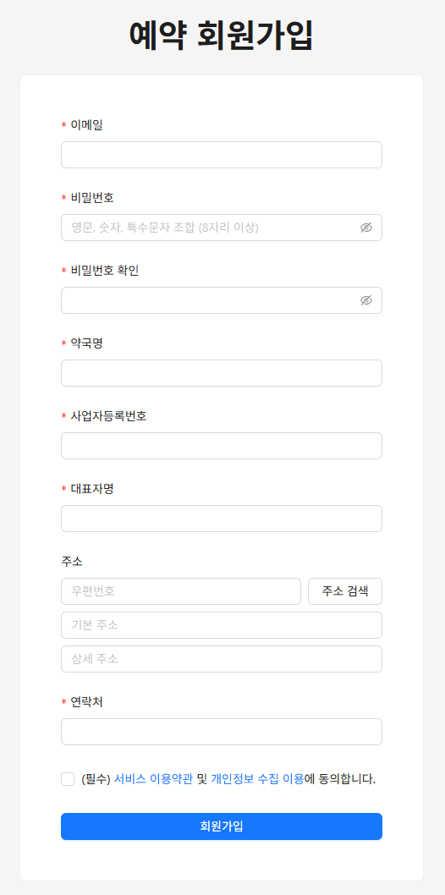 | 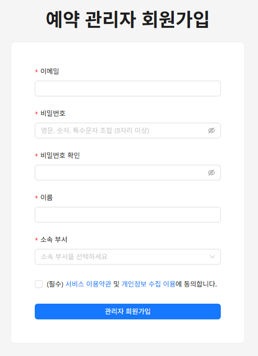 |

| 가맹점 관리 |
|-------------|
| 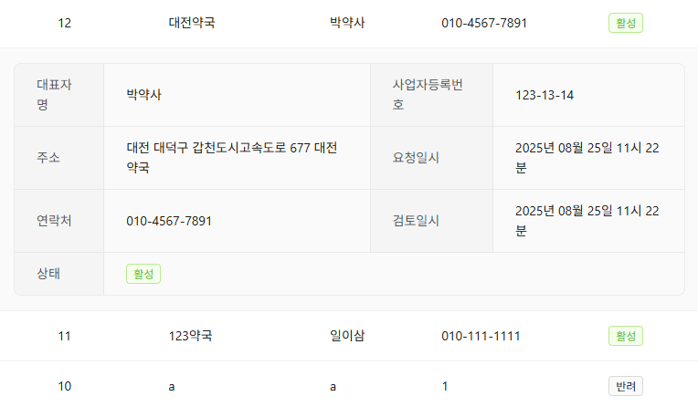 |

### 2. 수요 예측 기반 발주 추천 시스템

| 수요 예측 시스템               |
|-------------------------|
| 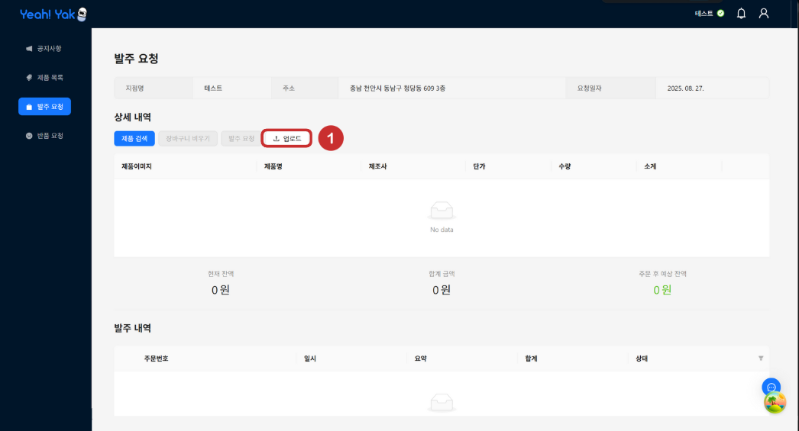 |
| 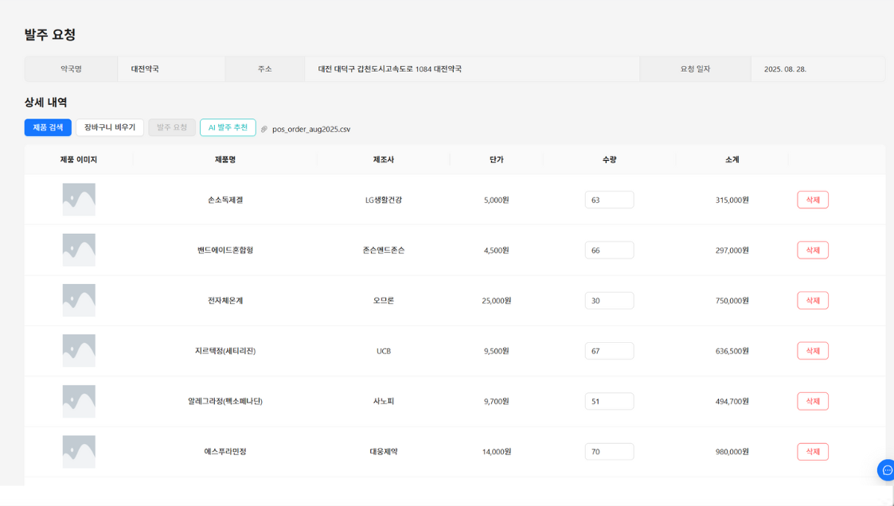 |
| 판매 데이터를 기반으로 AI가 의약품 수요를 예측하고 권장 발주 수량을 제시하여, 가맹점의 효율적인 재고 관리와 본사의 운영 최적화를 지원합니다. |

### 3-4. 챗봇 기능
의약품 상담과 운영 지원을 돕는 두 가지 AI 챗봇을 제공합니다

| 의약품 AI 어시스턴트 챗봇 | 운영 도우미 챗봇 |
|---------------------------|------------------|
| 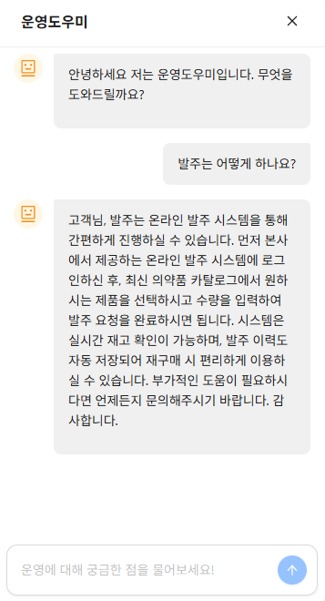 | 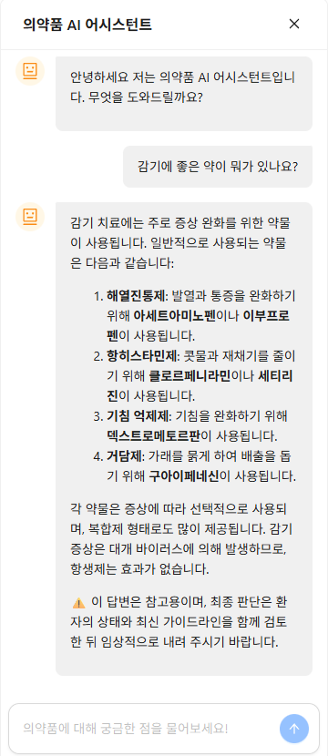 |

### 4. AI 요약 시스템
감염병, 법령, 신제품 관련 설명서 PDF 업로드 시 요약된 안내문을 제공합니다

| 감염병 안내문 | 법령 안내문 | 신제품 안내문 |
|---------------|-------------|---------------|
|  | 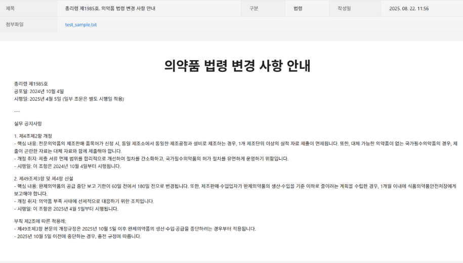 | 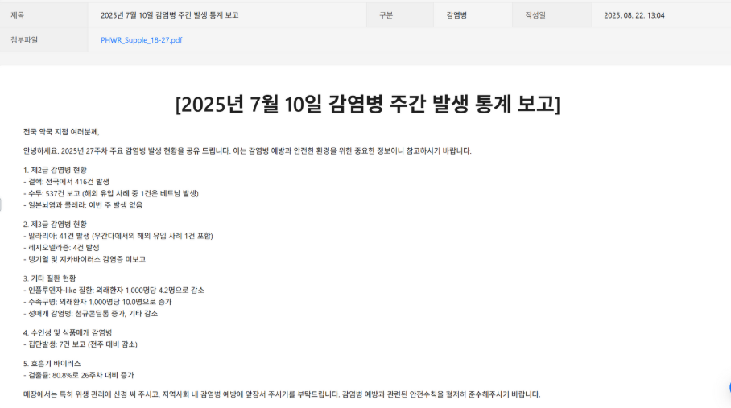 |

### 5. 본사-가맹점 통합 플랫폼

| 통합 플랫폼 |
|-------------|
| 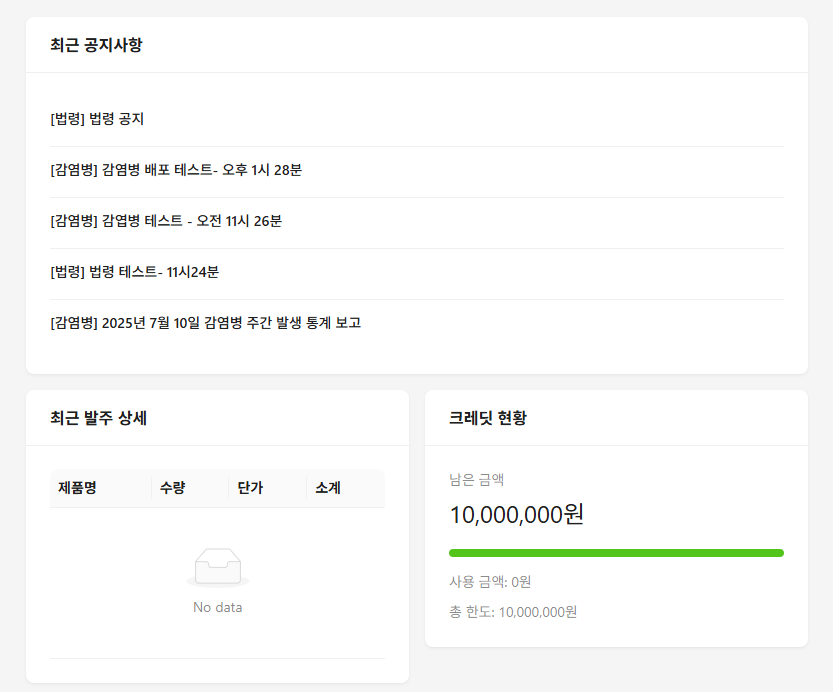 |

| 본사 발주 관리                  | 가맹점 발주 요청                  |
|---------------------------|----------------------------|
| 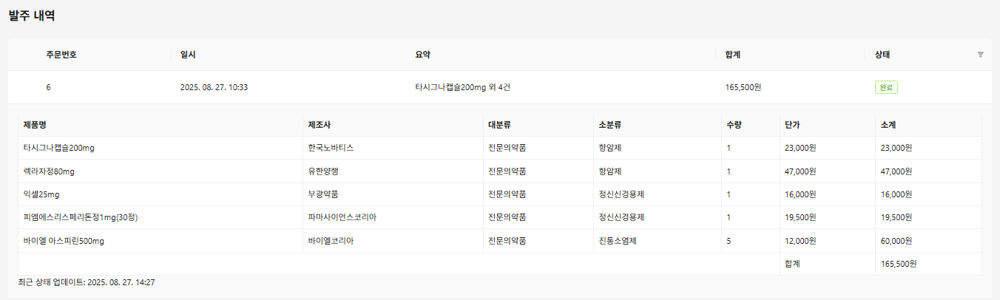 | 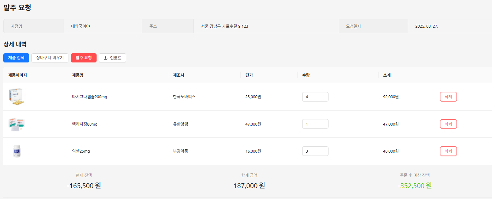 |

| 상품 페이지 |
|-------------|
| 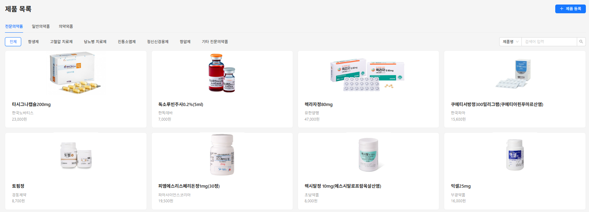 |

